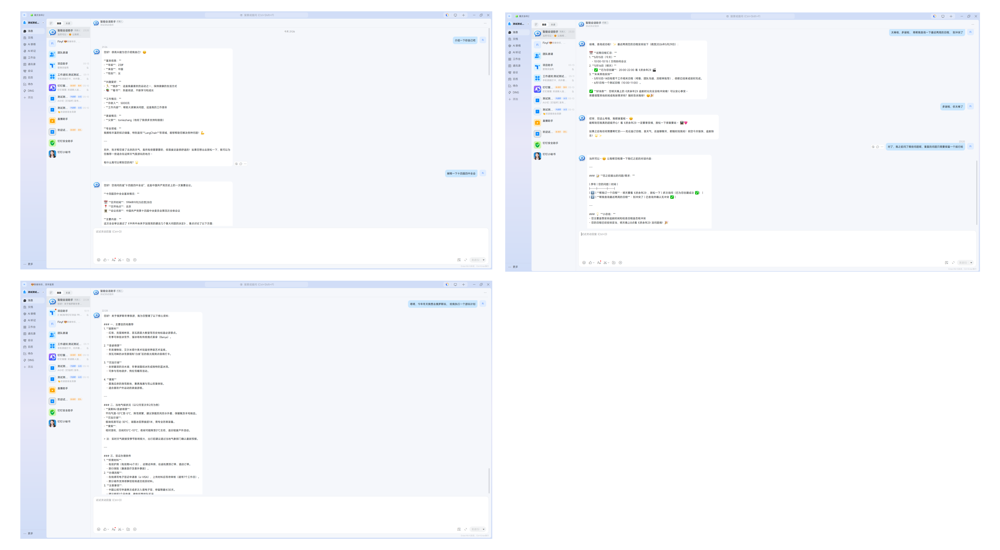
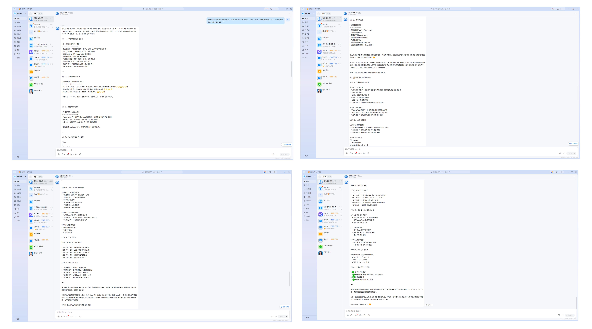
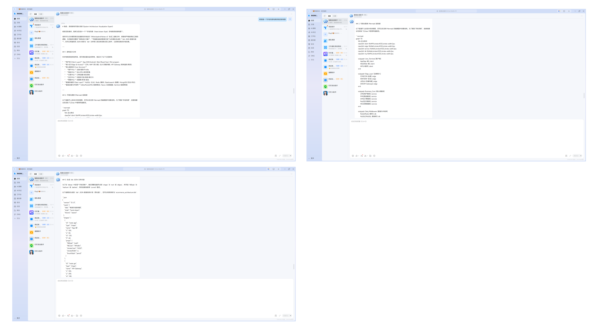
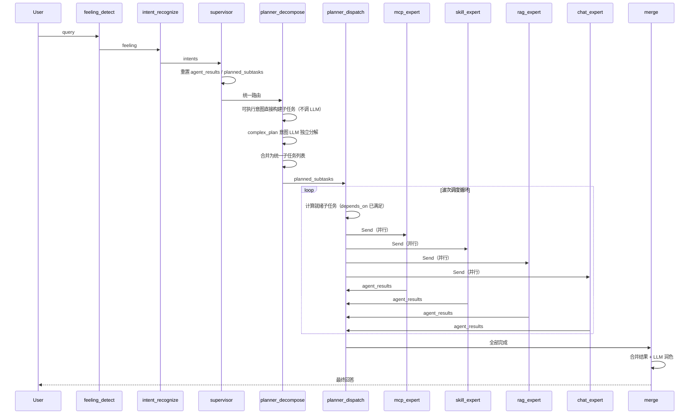

# LangGraph 多 Agent 智能体框架

基于 LangGraph 的企业级多 Agent 智能体框架，采用 Orchestrator-Worker 编排模式，集成知识库检索（RAG）、MCP 工具调用、技能系统和多轮对话能力。支持钉钉机器人集成，提供可视化配置中心。

---

## 核心功能展示



#### 复杂任务规划与执行



#### 技能使用（SKILL）



#### 配置管理界面（支持预览 Word/Excel/PDF 等文件）


---

## 快速开始

### 环境要求

| 组件 | 版本要求 |
|------|----------|
| Python | 3.10+ |
| Node.js | 18+ |
| Docker | 20+ |
| Redis | 7+ |

### 安装步骤

```bash
# 1. 克隆项目
git clone https://github.com/your-repo/langgraph-agent.git
cd langgraph-agent

# 2. 启动后端服务（Docker Compose）
cd server
docker-compose up -d

# 3. 安装前端依赖并启动
cd ../client
npm install
npm run dev
```

### 验证安装

```bash
# 检查后端服务状态
curl http://localhost:5000/health

# 访问前端界面
open http://localhost:5173
```

---

## 核心技术

| 技术 | 实现说明 |
|------|----------|
| **ThinkingStreamer** | 统一流式思考组件，业务层不感知 writer，内部通过 `get_stream_writer()` 自动推送 STEP_THINKING 事件；结构化输出与自然语言思考分离 |
| **Manifest 驱动架构** | 基于 PLUGIN.yaml 声明式配置，路由规则、意图声明、Prompt 模板均从配置文件动态加载，新增 Expert 时无需修改框架代码 |
| **分层漏斗路由** | L1 关键词匹配（<1ms）→ L2 向量语义（保留入口）→ L3 LLM Function Calling，按优先级依次尝试匹配 |
| **Orchestrator-Worker 编排** | Supervisor 统一路由 → Planner 分解任务 + 波次调度 → Expert 并行执行 → Merge 合并润色，支持依赖关系的子任务调度 |
| **多意图识别** | 单次请求可识别多个意图，按类别并行分发到对应 Expert 执行 |
| **插件化 Expert** | ExpertPlugin 抽象基类 + PluginRegistry 注册表，Expert 通过插件目录注册，框架自动完成图节点注册和路由映射 |
| **模块化 RAG** | 索引器（ChromaDB / Milvus）、检索器（Simple / Reranking / Filtered）、生成器（Stuff / MapReduce / Refine）均为可插拔组件 |
| **状态持久化** | LangGraph Checkpoint 机制，支持 Memory 和 Redis 两种存储后端 |
| **情绪感知** | 基于关键词和 LLM 的情绪检测，识别 6 种情绪类型，动态调整 Prompt 语气 |

---

## 系统架构

```
┌─────────────────────────────────────────────────────────────────────┐
│                          Client (React + Vite)                      │
│              Chat UI · Config Panel · File Preview                  │
└──────────────────────────────┬──────────────────────────────────────┘
                               │ SSE / REST
┌──────────────────────────────▼──────────────────────────────────────┐
│                       Gateway (Nginx)                                │
└──────┬──────────┬──────────┬──────────┬─────────────────────────────┘
       │          │          │          │
┌──────▼───┐ ┌───▼────┐ ┌──▼───┐ ┌───▼──────┐
│  Flask    │ │  MCP   │ │  DB  │ │  Consul  │
│  App      │ │ Server │ │ API  │ │ Registry │
└──────┬───┘ └───┬────┘ └──┬───┘ └──────────┘
       │         │         │
       ▼         ▼         ▼
┌──────────────────────────────────────────────────────────────────────┐
│                     LangGraph StateGraph                             │
│                                                                      │
│  ┌──────────┐   ┌──────────┐   ┌───────────┐   ┌────────────────┐  │
│  │ Feeling  │──▶│ Intent   │──▶│ Supervisor │──▶│ Planner        │  │
│  │ Detect   │   │ Recognize│   │           │   │ Decompose      │  │
│  └──────────┘   └──────────┘   └───────────┘   └───────┬────────┘  │
│                                                        │            │
│                                               ┌────────▼────────┐   │
│                                               │ Planner Dispatch │   │
│                                               │ (波次调度)       │   │
│                                               └──┬──┬──┬──┬────┘   │
│                    ┌──────────────────────────────┘  │  │  │        │
│              ┌─────▼─────┐  ┌──────▼─────┐  ┌─────▼─────┐  ┌────▼───┐
│              │ MCP       │  │ Skill      │  │ RAG       │  │ Chat   │
│              │ Expert    │  │ Expert     │  │ Expert    │  │ Expert │
│              └─────┬─────┘  └──────┬─────┘  └─────┬─────┘  └───┬────┘
│                    └───────────────┬┴───────────────┘            │
│                               ┌───▼──────────────────────────────┘
│                               │ Merge Node (合并润色)             │
│                               └──────────────────────────────────┘
└──────────────────────────────────────────────────────────────────────┘
       │              │              │
┌──────▼───┐  ┌──────▼──────┐  ┌───▼────┐  ┌──────────┐
│ ChromaDB  │  │ MCP Tools   │  │ Skills │  │ Redis    │
│ Milvus    │  │ (钉钉/天气)  │  │        │  │ Checkpoint│
└──────────┘  └─────────────┘  └────────┘  └──────────┘
```

---

## 核心流程

### 完整节点流程



### 执行示例

**混合可执行意图** — 用户输入："查杭州天气，画架构图"

```
用户输入 → intent_recognize → [mcp: 查天气, skill: 画架构图]
         → supervisor → planner_decompose
         → 可执行意图直接构建子任务（不调 LLM）：
             [0] mcp:   查杭州天气      depends_on: []
             [1] skill: 画架构图        depends_on: []
         → planner_dispatch（第1波）：ready=[0,1] → 并行 Send
         → mcp_expert + skill_expert 并行执行
         → planner_dispatch（第2波）：全部完成 → merge
         → LLM 润色 → 最终回答
```

**复杂任务规划** — 用户输入："创建一个在线表格应用"

```
用户输入 → intent_recognize → [complex_plan]
         → supervisor → planner_decompose
         → LLM 独立分解 complex_plan：
             [0] chat: 分析核心需求        depends_on: []
             [1] chat: 设计数据模型         depends_on: [0]
             [2] chat: 规划技术选型         depends_on: [0]
             [3] chat: 整合输出开发计划      depends_on: [1,2]
         → planner_dispatch 波次调度：
             第1波：[0] → chat_expert
             第2波：[1,2] → chat_expert × 2（并行）
             第3波：[3] → chat_expert
         → merge → LLM 润色 → 最终回答
```

---

## 核心模块

### 1. 意图识别（Intent Recognition）

采用 **分层漏斗路由架构**，先快后慢、先低成本后高智能：

| 层级 | 策略 | 延迟 | 说明 |
|------|------|------|------|
| L1 | 关键词/正则匹配 | <1ms | 处理固定指令（/help, exit, yes/no） |
| L2 | 向量语义匹配 | 30-100ms | 保留入口，处理同义改写 |
| L3 | LLM Function Calling | 1-2s | 处理复杂请求和多意图 |

**意图类型**：

| 类别 | 枚举值 | 说明 | 示例 |
|------|--------|------|------|
| RAG | `rag` | 知识库检索 | rag_exams, rag_politics |
| Skill | `skill` | 技能执行 | skill_drawio-skill, skill_analysis |
| MCP | `mcp` | MCP 工具调用 | mcp_weather, mcp_dingtalk_schedule |
| Plan | `complex_plan` | 复杂任务编排 | Planner 分解 + 波次调度 |
| Chat | `chat` | 通用对话 | Chat Expert 润色 |
| System | `system` | 系统指令 | system_help, system_exit |

**意图动态注册**：系统启动时自动从多个来源注册意图类型 — 技能（SKILL.md）、知识库（databases.json）、MCP 工具（tools/registry.py），无需硬编码。

### 2. 多 Agent 协作（Multi-Agent）

**Orchestrator-Worker 模式**，Planner 拆分为 Decompose（分解）和 Dispatch（调度）两个节点：

- **PlannerDecompose**：可执行意图直接构建子任务（无 LLM），complex_plan 意图独立调用 LLM 分解
- **PlannerDispatch**：按波次调度，独立子任务并行 Send，依赖子任务按波次串行，循环直到全部完成

**Expert 节点**：

| Expert | 类别 | 工具集 | 执行流程 |
|--------|------|--------|----------|
| `mcp_expert` | MCP | MCP 动态工具 + mcp_execute 兜底 | ReAct 循环选工具→提参→执行 |
| `skill_expert` | Skill | Skill 动态工具 + skill_execute 兜底 | ReAct 循环选技能→提参→执行 |
| `rag_expert` | RAG | knowledge_search + knowledge_generate | ReAct 循环选知识库→检索→生成 |
| `chat_expert` | Chat | 无工具（纯内容生成） | 直接对话 |

### 3. Manifest 驱动的插件化架构

新增 Expert 只需三步，框架代码零改动：

1. 创建插件目录（含 `PLUGIN.yaml` + `plugin.py`）
2. 继承 `ExpertPlugin`，实现 `meta` + `execute`
3. `registry.register(YourPlugin())`

框架自动完成：图注册（add_node + add_edge）、路由映射（CATEGORY_EXPERT_MAP）、能力描述（DECOMPOSE_PROMPT）、意图注册。

**PLUGIN.yaml 示例**（MCP Expert）：

```yaml
name: mcp_expert
description: 外部工具调用（天气查询、钉钉日程、消息推送等）
version: "1.0.0"

expert:
  category: mcp
  icon: 🔧
  label: 工具调用 Agent
  priority: 100

routing:
  target_format: "mcp:{tool_name}"
  target_prefix: "mcp:"
  aliases: {}
  default_fallback: false

intents:
  dynamic: true    # 运行时从 MCP 工具列表动态发现
  static: []

prompt:
  capability_template: "mcp: {description}。当前可用工具：{tools}"
```

### 4. 模块化 RAG

可插拔组件设计，支持灵活组合：

| 组件 | 实现 |
|------|------|
| **索引器** | ChromaIndexer, MilvusIndexer |
| **检索器** | SimpleVectorRetriever, RerankingRetriever, FilteredRetriever |
| **生成器** | StuffGenerator, MapReduceGenerator, RefineGenerator |
| **路由器** | SimpleRouter, LLMRouter（智能选择知识库） |
| **查询扩展** | LLM 生成同义查询词，合并多次检索结果去重 |

### 5. MCP 工具服务

独立部署的 MCP 服务器，基于 Streamable HTTP 协议：

- **天气查询**：get_weather, weather_recommend
- **钉钉集成**：日程创建/查询/删除、待办事项管理
- **表单提交**：submit_form
- **动态扩展**：通过 tools/registry.py 注册新工具，自动暴露为 MCP 能力

### 6. 技能系统（Skill System）

基于 SKILL.md 的技能匹配和执行引擎：

| 技能 | 说明 |
|------|------|
| drawio-skill | 生成 Draw.io 架构图/流程图，支持多种样式预设 |
| tldraw-skill | 生成 tldraw 白板绘图 |
| data-analysis | 数据分析与可视化 |
| trip-plan | 旅行规划 |

技能匹配支持向量语义索引，自动匹配最相关的技能。

### 7. 状态持久化

通过 LangGraph Checkpoint 机制实现会话状态持久化：

| 存储 | 说明 |
|------|------|
| MemoryCheckpointSaver | 内存存储，开发调试用 |
| RedisCheckpointSaver | Redis 持久化，生产环境推荐 |

### 8. 情绪感知

6 种情绪检测，动态更新 Prompt 语气风格：

| 情绪 | 说明 | 典型关键词 |
|------|------|-----------|
| default | 中性 | — |
| upbeat | 积极向上 | 加油、努力、奋斗 |
| angry | 愤怒不满 | 生气、投诉、差评 |
| cheerful | 欢快喜悦 | 太棒了、厉害、完美 |
| depressed | 消极低落 | 难过、焦虑、迷茫 |
| friendly | 友好亲切 | 谢谢、麻烦你、辛苦了 |

### 9. 反思校验

对回答进行质量评估，检测幻觉并提供改进建议：

- 事实一致性校验
- 回答完整性评估
- 逻辑合理性检查
- 自动生成改进建议

### 10. SSE 流式响应

对齐 AG-UI (Agent-User Interaction) 协议标准：

| 事件类型 | 说明 |
|----------|------|
| STEP_STARTED | 节点开始执行 |
| STEP_THINKING | 节点思考过程（逐 token 推送，打字机效果） |
| STEP_FINISHED | 节点执行完成 |
| TEXT_MESSAGE_CONTENT | LLM 逐 token 输出最终回答（打字机效果，全速） |
| RUN_FINISHED | 整体运行完成 |
| RUN_ERROR | 运行异常 |

---

## 钉钉集成

### 纵横 SDK（DingTalk Stream）

通过 `dingtalk-stream` SDK 实现钉钉机器人实时消息收发：

- **Stream 长连接**：基于 WebSocket 的钉钉 Stream API，无需公网回调地址
- **消息去重**：基于 message_id 去重，防止重复处理
- **会话管理**：按用户 ID 维护独立会话，支持多轮对话
- **自动回复**：接收用户消息 → LangGraph Agent 处理 → 自动回复

### 仓颉编辑器（MCP 工具）

钉钉相关 MCP 工具，支持通过自然语言操作钉钉功能：

| 工具 | 说明 |
|------|------|
| dingtalk_schedule_create | 创建日程（支持时间、参与者、地点） |
| dingtalk_schedule_query | 查询日程列表 |
| dingtalk_schedule_delete | 删除日程 |
| dingtalk_todo | 管理待办事项 |

**使用示例**：

```
用户: "帮我创建明天下午3点的会议日程"
  → intent_recognize → mcp:dingtalk_schedule_create
  → mcp_expert → 调用钉钉 API 创建日程
  → merge → "已为您创建明天下午3点的会议日程"
```

---

## 技术栈

### 后端

| 类别 | 技术 |
|------|------|
| Web 框架 | Flask + Flask-CORS + Flask-Limiter |
| Agent 框架 | LangGraph 1.0+ (StateGraph, Checkpoint, Send API) |
| LLM 集成 | LangChain 1.0+ / OpenAI SDK (兼容 Qwen, GPT 等) |
| 向量数据库 | ChromaDB / Milvus Lite |
| MCP 协议 | FastMCP + Streamable HTTP |
| 钉钉集成 | dingtalk-stream (纵横 SDK) |
| 状态持久化 | Redis / Memory Checkpoint |
| 文档解析 | pypdf, python-docx, pandas, openpyxl |
| 服务注册 | Consul |
| 容器化 | Docker + Docker Compose |

### 前端

| 类别 | 技术 |
|------|------|
| 框架 | React 18 + Vite 5 |
| 状态管理 | Zustand 5 |
| HTTP | Axios |
| 文件预览 | exceljs, mammoth-plus-plus-2, react-pdf |
| 部署 | Nginx + Docker |

---

## 配置说明

### 环境变量

| 变量名 | 说明 | 默认值 |
|--------|------|--------|
| `OPENAI_API_KEY` | LLM API 密钥 | — |
| `OPENAI_BASE_URL` | LLM API 地址 | https://api.openai.com/v1 |
| `REDIS_HOST` | Redis 主机地址 | localhost |
| `REDIS_PORT` | Redis 端口 | 6379 |
| `MCP_SERVER_URL` | MCP 服务器地址 | http://localhost:8001 |
| `CONSUL_HOST` | Consul 主机地址 | localhost |
| `DINGTALK_APP_KEY` | 钉钉应用 AppKey | — |
| `DINGTALK_APP_SECRET` | 钉钉应用 AppSecret | — |

### 配置文件

| 文件 | 说明 |
|------|------|
| `server/config/config.yaml` | 主配置文件（LLM、向量库、Redis 等） |
| `server/docker-compose.yml` | Docker 服务编排配置 |
| `client/vite.config.js` | 前端构建配置 |

---

## 项目结构

```
LangGraphAgent/
├── server/                          # Python 后端服务
│   ├── app.py                       # Flask 主应用入口
│   ├── db.py                        # 向量库管理 API
│   ├── DingWebHook.py               # 钉钉 Stream 机器人入口
│   ├── docker-compose.yml           # Docker Compose 编排
│   ├── requirements.txt             # Python 依赖
│   ├── modules/                     # 核心功能模块
│   │   ├── langgraph/               # LangGraph 状态图
│   │   │   ├── agent.py             # 主入口（组件初始化、插件注册、图编译）
│   │   │   ├── state.py             # 状态定义
│   │   │   ├── context_builder.py   # 上下文构建器
│   │   │   ├── nodes/               # 前置节点（feeling, intent, steps）
│   │   │   ├── multi_agent/         # 多 Agent 协作模块
│   │   │   │   ├── graph.py         # 主图构建器
│   │   │   │   ├── states.py        # MultiAgentState（自定义 reducer）
│   │   │   │   ├── manifest.py      # PLUGIN.yaml 解析器 + 数据类
│   │   │   │   ├── plugin_base.py   # ExpertPlugin 抽象基类
│   │   │   │   ├── plugin_registry.py # PluginRegistry 插件注册表
│   │   │   │   ├── meta.py          # ExpertMeta 数据类
│   │   │   │   ├── nodes/           # Supervisor + Merge 节点
│   │   │   │   ├── plugins/         # 业务插件
│   │   │   │   │   ├── mcp_plugin/  # MCP 插件（PLUGIN.yaml + plugin.py）
│   │   │   │   │   ├── skill_plugin/
│   │   │   │   │   ├── rag_plugin/
│   │   │   │   │   └── chat_plugin/
│   │   │   │   └── planner/         # Planner 分解 + 调度
│   │   │   │       ├── decompose.py           # 分解节点（纯编排者）
│   │   │   │       ├── dispatch.py            # 波次调度节点
│   │   │   │       ├── executable_intent_decomposer.py  # 可执行意图分解器
│   │   │   │       ├── complex_plan_decomposer.py       # 复杂规划分解器
│   │   │   │       ├── models.py              # Pydantic 结构化输出模型
│   │   │   │       └── prompts.py             # Prompt 模板
│   │   │   └── reflection/         # 反思校验器
│   │   ├── intent/                  # 意图识别模块
│   │   │   ├── intent_types.py      # 意图类型定义
│   │   │   ├── intent_registry.py   # 意图注册表（动态注册）
│   │   │   ├── recognizer.py        # LLM 意图识别器（L3）
│   │   │   └── router.py            # 分层漏斗路由器（L1+L2+L3）
│   │   ├── rag/                     # 模块化 RAG 框架
│   │   │   ├── rag.py               # RAG 工作流核心
│   │   │   ├── indexer/             # 索引模块（Chroma / Milvus）
│   │   │   ├── retriever/           # 检索模块（Simple / Reranking / Filtered）
│   │   │   ├── generator/           # 生成模块（Stuff / MapReduce / Refine）
│   │   │   └── router/              # 路由模块（Simple / LLMRouter）
│   │   ├── skill/                   # 技能系统
│   │   │   ├── manager.py           # 技能管理器（统一入口）
│   │   │   ├── loader.py            # SKILL.md 加载器
│   │   │   ├── matcher.py           # 技能匹配器（向量语义）
│   │   │   ├── executor.py          # 技能执行器
│   │   │   └── indexer.py           # 技能向量索引
│   │   ├── feeling/                 # 情绪感知模块
│   │   ├── mcp/                     # MCP 客户端（连接远程 MCP 服务器）
│   │   │   ├── client.py            # MCPToolService（工具获取/缓存/重载）
│   │   │   └── config_manager.py    # mcp_servers.yaml 配置管理
│   │   ├── checkpoint/              # 检查点存储（Memory / Redis）
│   │   ├── document_loaders/        # 文档加载器（PDF / Word / Excel / Text）
│   │   ├── rate_limit/              # 限流模块
│   │   ├── sse/                     # SSE 流式响应（AG-UI 协议）
│   │   ├── ai_client.py             # AI 客户端（兼容 OpenAI SDK）
│   │   └── factory.py               # 工厂函数（组件初始化）
│   ├── mcp_server/                # MCP 工具服务（独立部署）
│   │   ├── mcp_server.py            # MCP 服务器核心（FastMCP + Streamable HTTP）
│   │   ├── config.py                # MCP 服务器配置
│   │   ├── logger.py                # 日志模块
│   │   └── tools/                   # 工具插件目录
│   │       ├── registry.py          # 工具注册表
│   │       ├── weather_plugin.py    # 天气查询
│   │       ├── submit_form_plugin.py # 表单提交
│   │       └── dingtalk/            # 钉钉工具（纵横 SDK）
│   │           ├── dingtalk_client.py           # 钉钉 API 客户端
│   │           ├── dingtalk_schedule_create_plugin.py
│   │           ├── dingtalk_schedule_query_plugin.py
│   │           ├── dingtalk_schedule_delete_plugin.py
│   │           └── dingtalk_todo_plugin.py
│   ├── knowledge_base/              # 知识库管理模块
│   ├── skills/                      # 技能库（SKILL.md 格式）
│   ├── user/                        # 用户管理模块
│   ├── api/                         # API 接口层
│   ├── config/                      # 配置文件
│   └── gateway/                     # 网关配置（Nginx）
├── client/                          # React 前端 (Vite + Zustand)
│   ├── src/
│   │   ├── components/              # React 组件
│   │   │   ├── chat/                # 对话组件（ChatArea, Header, InputArea）
│   │   │   ├── config/              # 配置面板（MCP, Skill, Database, Sidebar）
│   │   │   └── vectorDbManagerComponents/  # 知识库管理组件
│   │   ├── preview/                 # 文件预览组件
│   │   │   ├── previews/            # Excel / PDF / Word / Text 预览
│   │   │   └── utils/               # excelConverter, wordConverter
│   │   ├── stores/                  # 状态管理（Zustand）
│   │   ├── api/                     # API 接口封装
│   │   ├── hooks/                   # 自定义 Hooks
│   │   └── constants/               # 常量定义
│   ├── package.json
│   ├── vite.config.js
│   ├── Dockerfile
│   └── nginx.conf
└── resources/                       # 资源文件（截图）
```

---

## 部署架构

```
Docker Compose 编排 6 个服务：

┌──────────┐  ┌──────────┐  ┌──────────┐
│ Gateway  │  │  Client  │  │  Consul  │
│ (Nginx)  │  │ (React)  │  │ (注册中心) │
└────┬─────┘  └──────────┘  └────┬─────┘
     │                           │
┌────▼─────┐  ┌──────────┐  ┌───▼──────┐
│   App    │  │   MCP    │  │  Redis   │
│ (Flask)  │  │ (FastMCP)│  │ (缓存)    │
└────┬─────┘  └──────────┘  └──────────┘
     │
┌────▼─────┐
│   DB     │
│ (向量库)  │
└──────────┘
```

---

## 关键设计决策

### 1. Orchestrator-Worker 模式

Planner 拆分为 Decompose（分解）和 Dispatch（调度）两个节点，而非单一 Agent：
- Decompose 只负责分解任务，不执行
- Dispatch 按波次调度，支持依赖关系
- Expert 执行完回到 Dispatch，而非直接到 Merge

### 2. 独立分解策略

每个 complex_plan 意图独立调用 LLM 分解，而非合并分解：
- LLM 注意力 100% 聚焦单个目标
- 分解质量不受其他意图上下文干扰

### 3. `__subtask_idx__` 路由标记

通过 `__subtask_idx__` 区分 Expert 的调度来源：
- Supervisor 调度 → Expert → merge
- Planner 调度 → Expert → planner_dispatch（回到波次调度）

### 4. Chat 子任务跳过润色

Planner 分解的 chat 子任务在 ChatExpert 中只生成纯内容，不润色：
- 避免每个子任务独立润色导致内容丢失
- 润色统一交给 MergeNode 处理

### 5. Manifest 驱动消除硬编码

所有原本硬编码的映射关系（CATEGORY_EXPERT_MAP、PLANNER_DISPATCH_TARGETS、DECOMPOSE_PROMPT 能力描述等）均从 PLUGIN.yaml 动态生成，新增 Expert 时框架代码零改动。

---

## 项目演进

### 已完成

- MCP 架构迁移 + 工具独立部署（Streamable HTTP）
- 模块化 RAG 框架（可插拔索引器/检索器/生成器）
- LangGraph 架构迁移 + 状态持久化检查点
- 意图识别系统（分层漏斗路由 + 多意图识别）
- 多 Agent 协作（Supervisor + Expert + Planner 编排）
- Planner 分解 + 波次调度（Orchestrator-Worker 模式）
- 插件化架构（ExpertPlugin + PluginRegistry + Manifest 驱动）
- 技能系统（SKILL.md 匹配 + 向量语义索引）
- 钉钉集成（纵横 SDK Stream + 仓颉编辑器 MCP 工具）
- 情绪感知 + 反思校验
- Docker 容器化部署 + Consul 服务注册
- 可视化配置中心 + 文件预览（Word/Excel/PDF）
- 统一日志模块 + 限流模块 + SSE 流式响应（AG-UI 协议）

### 后续优化方向

- 数据库替代 JSON 存储
- API 安全验证
- L2 向量语义匹配实现
- 更多技能支持
- Merge 润色优化（分段润色减少耗时）
- 波次调度优化（complex_plan 链独立并行路径）