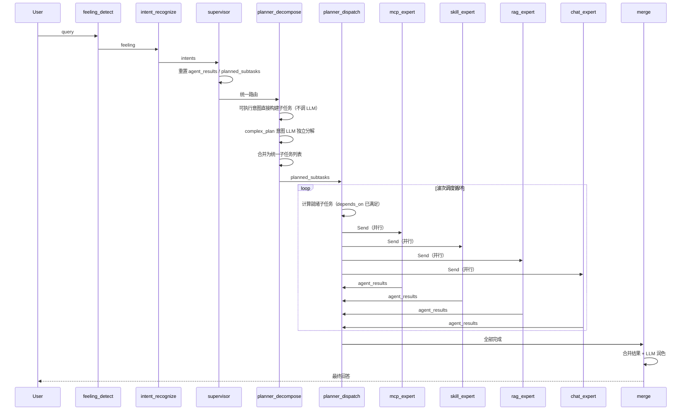

# LangGraph 多 Agent 智能体框架

基于 LangGraph 的企业级多 Agent 智能体框架，采用 Orchestrator-Worker 编排模式，集成知识库检索（RAG）、MCP 工具调用、技能系统和多轮对话能力。支持钉钉机器人集成，提供可视化配置中心。

---

## 核心设计

### 1. 统一流式思考组件 — 业务层零感知

设计了 `ThinkingStreamer` 组件，通过 LangGraph 原生 `get_stream_writer()` + contextvars 机制，在任意调用深度自动获取 writer。业务层（Detector / Recognizer / Expert）通过 `stream_llm()` / `stream_agent()` 接口调用，完全不感知流式/同步差异，符合单一职责原则。

**架构决策**：结构化输出（情绪分析 JSON、意图识别 JSON）与自然语言思考过程走不同路径 — 前者通过 `stream_llm_structured()` 静默收集，后者通过 `stream_llm()` 逐 token 推送 STEP\_THINKING 事件。用户看到的是节点 COMPLETED 摘要 + 实时思考过程，而非原始 JSON。

### 2. Manifest 驱动的插件化架构 — 新增 Expert 零改动框架

所有 Expert 通过 `PLUGIN.yaml` 声明式配置，框架启动时自动完成图节点注册（add\_node + add\_edge）、路由映射（CATEGORY\_EXPERT\_MAP）、能力描述（DECOMPOSE\_PROMPT）、意图注册。新增 Expert 只需三步：创建插件目录 → 继承 `ExpertPlugin` → 注册，框架代码零改动。

**架构决策**：将原本硬编码的映射关系（专家类别→节点、意图→路由、能力描述）全部从 Manifest 动态生成，消除了新增 Expert 时的框架代码侵入。

### 3. Orchestrator-Worker 编排 — 波次调度支持任务依赖

Planner 拆分为 Decompose（分解）和 Dispatch（调度）两个节点。Dispatch 按波次调度：独立子任务并行 Send，依赖子任务按波次串行，循环直到全部完成。每个 complex\_plan 意图独立调用 LLM 分解，LLM 注意力 100% 聚焦单个目标，分解质量不受其他意图上下文干扰。

**架构决策**：Expert 执行完回到 Dispatch（而非直接到 Merge），通过 `__subtask_idx__` 路由标记区分调度来源，支持多波次依赖调度。

### 4. 分层漏斗路由 — 先快后慢、先低成本后高智能

意图识别采用三级漏斗：L1 关键词匹配（<1ms）→ L2 向量语义（保留入口）→ L3 LLM Function Calling（1-2s）。意图类型从多个来源动态注册（技能 SKILL.md、知识库 databases.json、MCP 工具 registry.py），无需硬编码。

### 5. 模块化 RAG — 可插拔组件设计

索引器（ChromaDB / Milvus）、检索器（Simple / Reranking / Filtered）、生成器（Stuff / MapReduce / Refine）均为可插拔组件，支持灵活组合。路由器支持 LLM 智能选择知识库，查询扩展通过 LLM 生成同义查询词合并去重。

***

## 系统架构

```
┌─────────────────────────────────────────────────────────────────────┐
│                          Client (React + Vite)                      │
│              Chat UI · Config Panel · File Preview                  │
└──────────────────────────────┬──────────────────────────────────────┘
                               │ SSE / REST
┌──────────────────────────────▼──────────────────────────────────────┐
│                       Gateway (Nginx)                                │
└──────┬──────────┬──────────┬──────────┬─────────────────────────────┘
       │          │          │          │
┌──────▼───┐ ┌───▼────┐ ┌──▼───┐ ┌───▼──────┐
│  Flask    │ │  MCP   │ │  DB  │ │  Consul  │
│  App      │ │ Server │ │ API  │ │ Registry │
└──────┬───┘ └───┬────┘ └──┬───┘ └──────────┘
       │         │         │
       ▼         ▼         ▼
┌──────────────────────────────────────────────────────────────────────┐
│                     LangGraph StateGraph                             │
│                                                                      │
│  ┌──────────┐   ┌──────────┐   ┌───────────┐   ┌────────────────┐  │
│  │ Feeling  │──▶│ Intent   │──▶│ Supervisor │──▶│ Planner        │  │
│  │ Detect   │   │ Recognize│   │           │   │ Decompose      │  │
│  └──────────┘   └──────────┘   └───────────┘   └───────┬────────┘  │
│                                                        │            │
│                                               ┌────────▼────────┐   │
│                                               │ Planner Dispatch │   │
│                                               │ (波次调度)       │   │
│                                               └──┬──┬──┬──┬────┘   │
│                    ┌──────────────────────────────┘  │  │  │        │
│              ┌─────▼─────┐  ┌──────▼─────┐  ┌─────▼─────┐  ┌────▼───┐
│              │ MCP       │  │ Skill      │  │ RAG       │  │ Chat   │
│              │ Expert    │  │ Expert     │  │ Expert    │  │ Expert │
│              └─────┬─────┘  └──────┬─────┘  └─────┬─────┘  └───┬────┘
│                    └───────────────┬┴───────────────┘            │
│                               ┌───▼──────────────────────────────┘
│                               │ Merge Node (合并润色)             │
│                               └──────────────────────────────────┘
└──────────────────────────────────────────────────────────────────────┘
       │              │              │
┌──────▼───┐  ┌──────▼──────┐  ┌───▼────┐  ┌──────────┐
│ ChromaDB  │  │ MCP Tools   │  │ Skills │  │ Redis    │
│ Milvus    │  │ (钉钉/天气)  │  │        │  │ Checkpoint│
└──────────┘  └─────────────┘  └────────┘  └──────────┘
```

***

## 核心流程

### 完整节点流程



### 执行示例

**混合可执行意图** — 用户输入："查杭州天气，画架构图"

```
用户输入 → intent_recognize → [mcp: 查天气, skill: 画架构图]
         → supervisor → planner_decompose
         → 可执行意图直接构建子任务（不调 LLM）：
             [0] mcp:   查杭州天气      depends_on: []
             [1] skill: 画架构图        depends_on: []
         → planner_dispatch（第1波）：ready=[0,1] → 并行 Send
         → mcp_expert + skill_expert 并行执行
         → planner_dispatch（第2波）：全部完成 → merge
         → LLM 润色 → 最终回答
```

**复杂任务规划** — 用户输入："创建一个在线表格应用"

```
用户输入 → intent_recognize → [complex_plan]
         → supervisor → planner_decompose
         → LLM 独立分解 complex_plan：
             [0] chat: 分析核心需求        depends_on: []
             [1] chat: 设计数据模型         depends_on: [0]
             [2] chat: 规划技术选型         depends_on: [0]
             [3] chat: 整合输出开发计划      depends_on: [1,2]
         → planner_dispatch 波次调度：
             第1波：[0] → chat_expert
             第2波：[1,2] → chat_expert × 2（并行）
             第3波：[3] → chat_expert
         → merge → LLM 润色 → 最终回答
```

***

## 核心模块

### 1. 意图识别（Intent Recognition）

采用 **分层漏斗路由架构**，先快后慢、先低成本后高智能：

| 层级 | 策略                   | 延迟       | 说明                          |
| -- | -------------------- | -------- | --------------------------- |
| L1 | 关键词/正则匹配             | <1ms     | 处理固定指令（/help, exit, yes/no） |
| L2 | 向量语义匹配               | 30-100ms | 保留入口，处理同义改写                 |
| L3 | LLM Function Calling | 1-2s     | 处理复杂请求和多意图                  |

**意图类型**：

| 类别     | 枚举值            | 说明       | 示例                                    |
| ------ | -------------- | -------- | ------------------------------------- |
| RAG    | `rag`          | 知识库检索    | rag\_exams, rag\_politics             |
| Skill  | `skill`        | 技能执行     | skill\_drawio-skill, skill\_analysis  |
| MCP    | `mcp`          | MCP 工具调用 | mcp\_weather, mcp\_dingtalk\_schedule |
| Plan   | `complex_plan` | 复杂任务编排   | Planner 分解 + 波次调度                     |
| Chat   | `chat`         | 通用对话     | Chat Expert 润色                        |
| System | `system`       | 系统指令     | system\_help, system\_exit            |

**意图动态注册**：系统启动时自动从多个来源注册意图类型 — 技能（SKILL.md）、知识库（databases.json）、MCP 工具（tools/registry.py），无需硬编码。

### 2. 多 Agent 协作（Multi-Agent）

**Orchestrator-Worker 模式**，Planner 拆分为 Decompose（分解）和 Dispatch（调度）两个节点：

- **PlannerDecompose**：可执行意图直接构建子任务（无 LLM），complex\_plan 意图独立调用 LLM 分解
- **PlannerDispatch**：按波次调度，独立子任务并行 Send，依赖子任务按波次串行，循环直到全部完成

**Expert 节点**：

| Expert         | 类别    | 工具集                                     | 执行流程               |
| -------------- | ----- | --------------------------------------- | ------------------ |
| `mcp_expert`   | MCP   | MCP 动态工具 + mcp\_execute 兜底              | ReAct 循环选工具→提参→执行  |
| `skill_expert` | Skill | Skill 动态工具 + skill\_execute 兜底          | ReAct 循环选技能→提参→执行  |
| `rag_expert`   | RAG   | knowledge\_search + knowledge\_generate | ReAct 循环选知识库→检索→生成 |
| `chat_expert`  | Chat  | 无工具（纯内容生成）                              | 直接对话               |

### 3. Manifest 驱动的插件化架构

新增 Expert 只需三步，框架代码零改动：

1. 创建插件目录（含 `PLUGIN.yaml` + `plugin.py`）
2. 继承 `ExpertPlugin`，实现 `meta` + `execute`
3. `registry.register(YourPlugin())`

框架自动完成：图注册（add\_node + add\_edge）、路由映射（CATEGORY\_EXPERT\_MAP）、能力描述（DECOMPOSE\_PROMPT）、意图注册。

**PLUGIN.yaml 示例**（MCP Expert）：

```yaml
name: mcp_expert
description: 外部工具调用（天气查询、钉钉日程、消息推送等）
version: "1.0.0"

expert:
  category: mcp
  icon: 🔧
  label: 工具调用 Agent
  priority: 100

routing:
  target_format: "mcp:{tool_name}"
  target_prefix: "mcp:"
  aliases: {}
  default_fallback: false

intents:
  dynamic: true    # 运行时从 MCP 工具列表动态发现
  static: []

prompt:
  capability_template: "mcp: {description}。当前可用工具：{tools}"
```

### 4. 模块化 RAG

可插拔组件设计，支持灵活组合：

| 组件       | 实现                                                           |
| -------- | ------------------------------------------------------------ |
| **索引器**  | ChromaIndexer, MilvusIndexer                                 |
| **检索器**  | SimpleVectorRetriever, RerankingRetriever, FilteredRetriever |
| **生成器**  | StuffGenerator, MapReduceGenerator, RefineGenerator          |
| **路由器**  | SimpleRouter, LLMRouter（智能选择知识库）                             |
| **查询扩展** | LLM 生成同义查询词，合并多次检索结果去重                                       |

### 5. MCP 工具服务

独立部署的 MCP 服务器，基于 Streamable HTTP 协议：

- **天气查询**：get\_weather, weather\_recommend
- **钉钉集成**：日程创建/查询/删除、待办事项管理
- **表单提交**：submit\_form
- **动态扩展**：通过 tools/registry.py 注册新工具，自动暴露为 MCP 能力

### 6. 技能系统（Skill System）

基于 SKILL.md 的技能匹配和执行引擎：

| 技能            | 说明                           |
| ------------- | ---------------------------- |
| drawio-skill  | 生成 Draw\.io 架构图/流程图，支持多种样式预设 |
| tldraw-skill  | 生成 tldraw 白板绘图               |
| data-analysis | 数据分析与可视化                     |
| trip-plan     | 旅行规划                         |

技能匹配支持向量语义索引，自动匹配最相关的技能。

### 7. 状态持久化

通过 LangGraph Checkpoint 机制实现会话状态持久化：

| 存储                    | 说明               |
| --------------------- | ---------------- |
| MemoryCheckpointSaver | 内存存储，开发调试用       |
| RedisCheckpointSaver  | Redis 持久化，生产环境推荐 |

### 8. 情绪感知

6 种情绪检测，动态更新 Prompt 语气风格：

| 情绪        | 说明   | 典型关键词      |
| --------- | ---- | ---------- |
| default   | 中性   | —          |
| upbeat    | 积极向上 | 加油、努力、奋斗   |
| angry     | 愤怒不满 | 生气、投诉、差评   |
| cheerful  | 欢快喜悦 | 太棒了、厉害、完美  |
| depressed | 消极低落 | 难过、焦虑、迷茫   |
| friendly  | 友好亲切 | 谢谢、麻烦你、辛苦了 |

### 9. SSE 流式响应

对齐 AG-UI (Agent-User Interaction) 协议标准：

| 事件类型                   | 说明                           |
| ---------------------- | ---------------------------- |
| STEP\_STARTED          | 节点开始执行                       |
| STEP\_THINKING         | 节点思考过程（逐 token 推送，打字机效果）     |
| STEP\_FINISHED         | 节点执行完成                       |
| TEXT\_MESSAGE\_CONTENT | LLM 逐 token 输出最终回答（打字机效果，全速） |
| RUN\_FINISHED          | 整体运行完成                       |
| RUN\_ERROR             | 运行异常                         |

***

## 配置中心

基于 React 的可视化配置管理界面，三个功能面板：

### 数据库管理

- 创建 / 删除知识库
- 文档上传（支持拖拽，格式：PDF / Word / Excel / TXT / MD），上传后自动进行 RAG 向量化索引
- 文档列表管理与删除
- 内置文件预览侧栏：
  - Excel：通过纵横 SDK 在线预览
  - Word：通过钉钉仓颉编辑器在线预览
  - PDF：通过 react-pdf 渲染预览
  - 纯文本：直接渲染

### MCP 配置

- 添加 / 删除 MCP 服务器（配置名称、URL、协议）
- 连接测试
- 服务器状态监控（connected / disconnected）

### Skill 管理

- 通过 URL 安装技能（自动下载 SKILL.md 并注册）
- 已安装技能列表查看与删除

***

## 钉钉集成

### 钉钉机器人（DingTalk Stream）

通过 `dingtalk-stream` SDK 实现钉钉机器人实时消息收发：

- **Stream 长连接**：基于 WebSocket 的钉钉 Stream API，无需公网回调地址
- **消息去重**：基于 message\_id 去重，防止重复处理
- **会话管理**：按用户 ID 维护独立会话，支持多轮对话
- **自动回复**：接收用户消息 → LangGraph Agent 处理 → 自动回复

### 纵横 SDK（表格预览）

钉钉在线表格预览能力，支持 Excel 文件在钉钉内直接打开和编辑。

### 仓颉编辑器（文字预览）

钉钉文档预览能力，支持 Word 等文档在钉钉内直接查看。

### 钉钉 MCP 工具

钉钉相关 MCP 工具，支持通过自然语言操作钉钉功能：

| 工具                         | 说明                |
| -------------------------- | ----------------- |
| dingtalk\_schedule\_create | 创建日程（支持时间、参与者、地点） |
| dingtalk\_schedule\_query  | 查询日程列表            |
| dingtalk\_schedule\_delete | 删除日程              |
| dingtalk\_todo             | 管理待办事项            |

**使用示例**：

```
用户: "帮我创建明天下午3点的会议日程"
  → intent_recognize → mcp:dingtalk_schedule_create
  → mcp_expert → 调用钉钉 API 创建日程
  → merge → "已为您创建明天下午3点的会议日程"
```

***

## 技术栈

### 后端

| 类别       | 技术                                                   |
| -------- | ---------------------------------------------------- |
| Web 框架   | Flask + Flask-CORS + Flask-Limiter                   |
| Agent 框架 | LangGraph 1.0+ (StateGraph, Checkpoint, Send API)    |
| LLM 集成   | LangChain 1.0+ / OpenAI SDK (兼容 Qwen, GPT 等)         |
| 向量数据库    | ChromaDB / Milvus Lite                               |
| MCP 协议   | FastMCP + Streamable HTTP                            |
| 钉钉集成     | dingtalk-stream (机器人) + 纵横 SDK (表格预览) + 仓颉编辑器 (文字预览) |
| 状态持久化    | Redis / Memory Checkpoint                            |
| 文档解析     | pypdf, python-docx, pandas, openpyxl                 |
| 服务注册     | Consul                                               |
| 容器化      | Docker + Docker Compose                              |

### 前端

| 类别   | 技术                                      | 说明 |
| ---- | --------------------------------------- | ---- |
| 框架   | React 18 + Vite 5                       | SPA，SSE 流式渲染 |
| 状态管理 | Zustand 5                               | 轻量级状态管理，替代 Redux |
| HTTP | Axios                                   | REST API 调用 |
| 文件预览 | exceljs（Excel 渲染）、mammoth-plus-plus-2（Word 转 HTML）、react-pdf（PDF 渲染） | 配置中心内置预览侧栏 |
| 钉钉预览 | 纵横 SDK（表格）、仓颉编辑器（文字） | 钉钉内直接打开/编辑 |
| 部署   | Nginx + Docker                          | 反向代理 + 静态资源 |

***

## 关键设计决策

### 1. ThinkingStreamer — 业务层与流式细节解耦

通过 `get_stream_writer()` + contextvars 机制，ThinkingStreamer 内部自动管理 writer，业务层通过 `stream_llm()` / `stream_llm_structured()` / `stream_agent()` 接口调用，完全不感知流式/同步差异。结构化输出与自然语言思考走不同路径，避免原始 JSON 暴露给用户。

### 2. Orchestrator-Worker 模式 — Planner 拆分

Planner 拆分为 Decompose（分解）和 Dispatch（调度）两个节点，而非单一 Agent：

- Decompose 只负责分解任务，不执行
- Dispatch 按波次调度，支持依赖关系
- Expert 执行完回到 Dispatch，而非直接到 Merge

### 3. 独立分解策略 — LLM 注意力聚焦

每个 complex\_plan 意图独立调用 LLM 分解，而非合并分解：

- LLM 注意力 100% 聚焦单个目标
- 分解质量不受其他意图上下文干扰

### 4. `__subtask_idx__` 路由标记 — 区分调度来源

通过 `__subtask_idx__` 区分 Expert 的调度来源：

- Supervisor 调度 → Expert → merge
- Planner 调度 → Expert → planner\_dispatch（回到波次调度）

### 5. Manifest 驱动 — 消除硬编码

所有原本硬编码的映射关系（CATEGORY\_EXPERT\_MAP、PLANNER\_DISPATCH\_TARGETS、DECOMPOSE\_PROMPT 能力描述等）均从 PLUGIN.yaml 动态生成，新增 Expert 时框架代码零改动。

### 6. MCP 客户端/服务端分离

`mcp_server/`（独立 MCP 服务器，FastMCP + 工具插件）与 `server/modules/mcp/`（MCP 客户端，连接远程 MCP 服务器获取工具）职责分离，避免客户端逻辑与服务端代码耦合。

### 7. Planner 双分解器 — 可执行意图零 LLM 开销

PlannerDecompose 节点内部委托给两个对称分解器：

| 分解器 | 适用意图 | 方式 | LLM 开销 |
|--------|----------|------|----------|
| ExecutableIntentDecomposer | mcp/skill/rag/chat/system | 规则映射，同类别合并为一个子任务 | 0 |
| ComplexPlanDecomposer | complex_plan | LLM 独立分解，结构化输出（TaskDecomposition） | 1-2s |

可执行类别从 PluginRegistry 动态获取，新增插件时无需修改分解器代码。ComplexPlanDecomposer 使用 `build_task_decomposition_model()` 运行时动态生成 Pydantic 模型，将 Manifest 中的类别选项和 target 格式描述注入 Field，确保 LLM 输出与注册插件一致。

### 8. MultiAgentState 自定义 Reducer — 并行安全状态合并

LangGraph Send API 并行分发 Expert 时，多个节点同时写入 state 需要自定义 reducer 解决冲突：

| 字段 | Reducer | 说明 |
|------|---------|------|
| `agent_results` | `add_agent_results` | 并行 Expert 追加结果；Supervisor 返回 None 重置（解决跨请求累积问题） |
| `planned_subtasks` | `keep_last` | 只读字段，并行节点值不变，取最后一个即可 |
| `__dispatch_complete__` | `keep_last` | 调度完成标记，取最后一个 |
| `chat_history` | `add_messages_with_truncation` | 原生保留 + 超长裁剪 |

### 9. AgentContext — 统一上下文管理

参考 Context Engineering 最佳实践，将 Agent 执行所需的用户信息、会话信息、执行上下文、运行时配置统一封装为 `AgentContext`（Pydantic BaseModel），避免参数爆炸。各模块通过 context 获取所需信息，而非逐层传递参数。

### 10. ConfigAwareAgentExecutor — 解决 LangChain config 传递缺失

LangChain Classic 的 AgentExecutor 在调用 `tool.run()` 时不传递 `RunnableConfig`，导致工具无法从 `config.configurable` 获取 skill\_name 等配置。通过重写 `_perform_agent_action` 方法，在工具调用时注入 config，确保 Skill 等动态工具能正确获取运行时配置。

### 11. 文档加载器工厂 — 可扩展的文档解析

`DocumentLoaderFactory` 采用注册模式，每种文件格式对应一个加载器：

| 格式 | 加载器 | 解析库 |
|------|--------|--------|
| PDF | PdfLoader | pypdf |
| Word | DocxLoader | python-docx |
| Excel | ExcelLoader | pandas + openpyxl |
| TXT/MD | TextLoader | 原生读取 |

新增格式只需 `DocumentLoaderFactory.register_loader(extension, LoaderClass)` 注册。

### 12. 统一流式事件协议 — StreamEvent

定义 Agent astream 的统一输出格式 `StreamEvent(token, event_type, metadata)`，所有实现 astream 的 Agent 必须遵循此协议。ThinkingStreamer 无需做格式判断，直接读取 token 字段。当前 Expert Agent 仍使用同步调用（invoke），未来实现 astream 后可支持 ReAct 循环中的逐 token 思考输出。

### 13. SSE 事件处理器 — 策略映射消除 if-elif

`SSEEventProcessor` 通过 `_STATUS_TO_EVENT` 映射表将 `StepStatus` 转换为 `EventType`，消除 if-elif 链。处理三种流模式（updates / custom / messages），统一输出 AG-UI 标准事件。

### 14. API 限流 — Flask-Limiter 集成

基于 Flask-Limiter 实现可配置的 API 限流，支持从环境变量读取限流规则（`RATE_LIMIT_ENABLED`、`RATE_LIMIT_DEFAULT`），按 IP 地址限流，防止接口滥用。

***

## 项目结构

```
LangGraphAgent/
├── mcp_server/                      # MCP 服务器（独立部署）
│   ├── mcp_server.py                # FastMCP 服务器核心（Streamable HTTP）
│   ├── config.py                    # MCP 服务器配置
│   ├── logger.py                    # 日志模块
│   ├── start.py                     # 启动脚本
│   └── tools/                       # 工具插件目录
│       ├── registry.py              # 工具注册表
│       ├── weather_plugin.py        # 天气查询
│       ├── weather_recommend_plugin.py  # 天气推荐
│       ├── submit_form_plugin.py    # 表单提交
│       └── dingtalk/                # 钉钉工具
│           ├── dingtalk_client.py   # 钉钉 API 客户端
│           ├── dingtalk_schedule_create_plugin.py
│           ├── dingtalk_schedule_query_plugin.py
│           ├── dingtalk_schedule_delete_plugin.py
│           └── dingtalk_todo_plugin.py
│
├── server/                          # Python 后端服务
│   ├── app.py                       # Flask 主应用入口
│   ├── db.py                        # 向量库管理 API
│   ├── DingWebHook.py               # 钉钉 Stream 机器人入口
│   ├── docker-compose.yml           # Docker Compose 编排
│   ├── requirements.txt             # Python 依赖
│   ├── config/                      # 配置文件
│   │   ├── config.yaml              # 主配置
│   │   └── mcp_servers.yaml         # MCP 服务器地址配置
│   ├── modules/                     # 核心功能模块
│   │   ├── langgraph/               # LangGraph 状态图
│   │   │   ├── agent.py             # 主入口（组件初始化、插件注册、图编译）
│   │   │   ├── state.py             # 状态定义
│   │   │   ├── context_builder.py   # 上下文构建器（RAG 文档/对话历史 → prompt）
│   │   │   ├── config_aware_executor.py  # ConfigAwareAgentExecutor（修复 config 传递）
│   │   │   ├── nodes/               # 前置节点（feeling, intent, steps）
│   │   │   └── multi_agent/         # 多 Agent 协作模块
│   │   │       ├── graph.py         # 主图构建器
│   │   │       ├── states.py        # MultiAgentState（自定义 reducer）
│   │   │       ├── thinking_streamer.py  # 统一流式思考组件
│   │   │       ├── manifest.py      # PLUGIN.yaml 解析器 + 数据类
│   │   │       ├── plugin_base.py   # ExpertPlugin 抽象基类
│   │   │       ├── plugin_registry.py # PluginRegistry 插件注册表
│   │   │       ├── meta.py          # ExpertMeta 数据类
│   │   │       ├── helpers.py       # 插件公共工具函数
│   │   │       ├── expert_agent_factory.py  # 领域专精 Agent 工厂（工具隔离）
│   │   │       ├── nodes/           # Supervisor + Merge 节点
│   │   │       ├── planner/         # 任务规划模块
│   │   │       │   ├── decompose.py       # 分解节点（纯编排者）
│   │   │       │   ├── dispatch.py        # 波次调度节点（Send API 并行）
│   │   │       │   ├── executable_intent_decomposer.py  # 可执行意图分解器（规则映射）
│   │   │       │   ├── complex_plan_decomposer.py       # 复杂意图分解器（LLM）
│   │   │       │   ├── models.py          # Pydantic 结构化输出模型（动态生成）
│   │   │       │   └── prompts.py         # 分解 Prompt 模板
│   │   │       ├── tools/           # Expert 工具适配器
│   │   │       │   ├── mcp_tools.py       # MCP 工具动态适配
│   │   │       │   ├── rag_tools.py       # RAG 工具封装
│   │   │       │   └── skill_tools.py     # Skill 工具动态适配
│   │   │       └── plugins/         # 业务插件
│   │   │           ├── mcp_plugin/  # MCP 插件（PLUGIN.yaml + plugin.py）
│   │   │           ├── rag_plugin/  # RAG 插件
│   │   │           ├── skill_plugin/ # Skill 插件
│   │   │           └── chat_plugin/ # Chat 插件
│   │   ├── executors/               # 意图执行器（Base → MCP/RAG/Skill）
│   │   ├── mcp/                     # MCP 客户端（连接远程 MCP 服务器）
│   │   │   ├── client.py            # MCPToolService（工具获取/缓存/重载）
│   │   │   └── config_manager.py    # mcp_servers.yaml 配置管理
│   │   ├── feeling/                 # 情绪感知模块
│   │   ├── checkpoint/              # 检查点存储（Memory / Redis）
│   │   ├── intent/                  # 意图识别模块
│   │   ├── rag/                     # RAG 模块
│   │   │   ├── rag.py               # RAG 业务入口
│   │   │   ├── indexer/             # 索引器（Chroma / Milvus）
│   │   │   ├── retriever/           # 检索器（Simple / Reranking / Filtered）
│   │   │   ├── generator/           # 生成器（Stuff / MapReduce / Refine）
│   │   │   └── router/              # 路由器（Simple / LLM 智能选择知识库）
│   │   ├── skill/                   # 技能系统
│   │   │   ├── loader.py            # 技能加载器（解析 SKILL.md）
│   │   │   ├── indexer.py           # 技能向量索引器（复用 ChromaIndexer）
│   │   │   ├── matcher.py           # 技能匹配器（语义 + 关键词兜底）
│   │   │   ├── executor.py          # 技能执行器
│   │   │   ├── manager.py           # 技能管理器
│   │   │   └── tools/               # 技能工具（list/instructions/run_script/save_file）
│   │   ├── document_loaders/        # 文档加载器工厂（PDF/Word/Excel/TXT）
│   │   ├── rate_limit/              # API 限流（Flask-Limiter）
│   │   ├── sse/                     # SSE 流式响应
│   │   │   ├── events.py            # AG-UI 事件类型定义
│   │   │   ├── processor.py         # SSE 事件处理器（策略映射）
│   │   │   └── formatter.py         # SSE 格式化输出
│   │   ├── ai_client.py             # LLM 客户端（LangChain ChatOpenAI + DashScope Embeddings）
│   │   ├── assistant.py             # LangChain Agent 封装
│   │   ├── context.py               # AgentContext 统一上下文
│   │   ├── factory.py               # 系统组件初始化工厂
│   │   ├── tools.py                 # 工具管理器（MCP + Skill 统一管理）
│   │   └── logger.py                # 统一日志模块
│   ├── skills/                      # 技能定义目录
│   │   └── {skill}/
│   │       └── SKILL.md             # 技能描述文件
│   ├── api/                         # REST API
│   └── tests/                       # 测试
│
└── client/                          # React 前端
    ├── src/
    │   ├── components/
    │   │   ├── chat/                # 对话组件（ChatArea, Header, InputArea）
    │   │   ├── config/              # 配置面板（MCP, Skill, Database, Sidebar）
    │   │   └── vectorDbManagerComponents/  # 知识库管理组件
    │   ├── preview/                 # 文件预览组件
    │   │   ├── previews/            # Excel / PDF / Word / Text 预览
    │   │   └── utils/               # excelConverter, wordConverter
    │   ├── stores/                  # 状态管理（Zustand）
    │   ├── api/                     # API 接口封装
    │   ├── hooks/                   # 自定义 Hooks
    │   └── constants/               # 常量定义
    ├── package.json
    ├── vite.config.js
    ├── Dockerfile
    └── nginx.conf
```

***

## 部署架构

```
Docker Compose 编排 6 个服务：

┌──────────┐  ┌──────────┐  ┌──────────┐
│ Gateway  │  │  Client  │  │  Consul  │
│ (Nginx)  │  │ (React)  │  │ (注册中心) │
└────┬─────┘  └──────────┘  └────┬─────┘
     │                           │
┌────▼─────┐  ┌──────────┐  ┌───▼──────┐
│   App    │  │   MCP    │  │  Redis   │
│ (Flask)  │  │ (FastMCP)│  │ (缓存)    │
└────┬─────┘  └──────────┘  └──────────┘
     │
┌────▼─────┐
│   DB     │
│ (向量库)  │
└──────────┘
```

***

## 项目演进

### 已完成

- MCP 架构迁移 + 工具独立部署（Streamable HTTP）
- 模块化 RAG 框架（可插拔索引器/检索器/生成器）
- LangGraph 架构迁移 + 状态持久化检查点
- 意图识别系统（分层漏斗路由 + 多意图识别）
- 多 Agent 协作（Supervisor + Expert + Planner 编排）
- Planner 分解 + 波次调度（Orchestrator-Worker 模式）
- 插件化架构（ExpertPlugin + PluginRegistry + Manifest 驱动）
- 统一流式思考组件（ThinkingStreamer，业务层零感知 writer）
- 技能系统（SKILL.md 匹配 + 向量语义索引）
- 钉钉集成（机器人 Stream + 纵横 SDK 表格预览 + 仓颉编辑器文字预览 + MCP 工具）
- 情绪感知
- Docker 容器化部署 + Consul 服务注册
- 可视化配置中心 + 文件预览（Word/Excel/PDF）
- 统一日志模块 + 限流模块 + SSE 流式响应（AG-UI 协议）

### 后续优化方向

- 数据库替代 JSON 存储
- API 安全验证
- L2 向量语义匹配实现
- 更多技能支持
- Merge 润色优化（分段润色减少耗时）

---

## Docker 部署

项目完整支持 Docker Compose 一键部署，编排 7 个服务：

```bash
cd server
docker-compose up -d
```

| 服务 | 镜像 | 端口 | 说明 |
|------|------|------|------|
| gateway | nginx:alpine | 80 / 443 | 反向代理网关 |
| client | 自建 (React) | 15174→80 | 前端界面 |
| app | 自建 (Flask) | 18000→5000 | 主应用（LangGraph Agent） |
| mcp | 自建 (FastMCP) | 8888→8080 | MCP 工具服务器 |
| db | 自建 (Flask) | 15001→5001 | 向量库管理 API |
| redis | redis:7-alpine | 16379→6379 | 缓存 + Checkpoint 持久化 |
| consul | consul:1.15 | 18500→8500 | 服务注册与发现 |

**服务依赖关系**：consul（健康检查）→ redis（健康检查）→ mcp → app / db → client → gateway

**数据持久化**：Redis 数据和 Consul 数据通过 Docker Volume 持久化；ChromaDB 向量库和知识库文件通过 Bind Mount 挂载。

**环境变量配置**：通过 `server/.env` 文件配置 API Key、模型、钉钉凭证等，`docker-compose.yml` 中引用 `${VAR:-default}` 格式，未设置时使用默认值。

---

## 核心功能展示


#### 复杂任务规划与执行


#### 技能使用（SKILL）


#### 配置管理界面（支持预览 Word/Excel/PDF 等文件）


