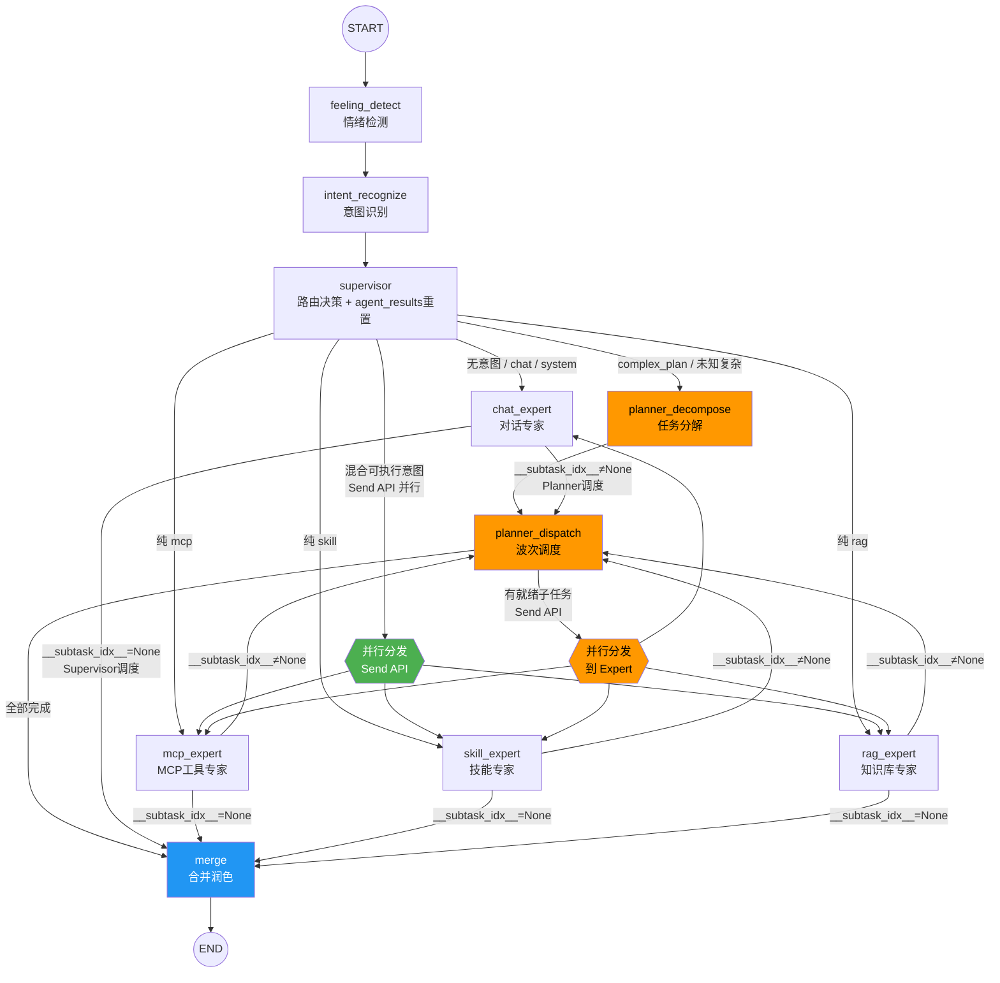

# 多 Agent 协作架构详解

## 一、整体架构概览

```
用户请求 → Flask API → LangGraphAgent → StateGraph → 最终回答
```

核心是一个 **LangGraph StateGraph**，基于 `MultiAgentState` 状态驱动，采用 **Orchestrator-Worker** 模式。

---

## 二、全景流程图



---

## 三、节点详解

### 1. feeling_detect（情绪检测）

| 项目 | 说明 |
|------|------|
| **输入** | `state["query"]` |
| **输出** | `{"feeling": FeelingState(feeling="neutral", score=5)}` |
| **实现** | `FeelingNode`，调用 `feeling_detector.detect(query)` |
| **作用** | 检测用户情绪，供后续润色使用 |

### 2. intent_recognize（意图识别）

| 项目 | 说明 |
|------|------|
| **输入** | `state["query"]` |
| **输出** | `{"intents": [{type, category, content, target, order, confidence}, ...], "is_multi_intent": bool}` |
| **实现** | `IntentRecognizeNode`，调用 `intent_router.recognize(query)` |
| **作用** | 将用户请求拆分为1~N个意图，每个意图有 category |

**意图类别**：

| category | 含义 | 示例 |
|----------|------|------|
| `mcp` | 外部工具调用 | 查天气、推送消息 |
| `skill` | 技能执行 | 绘制流程图 |
| `rag` | 知识库检索 | 航测蒙题技巧 |
| `chat` | 简单对话 | 你好、写首诗 |
| `complex_plan` | 复杂规划 | 创建在线表格应用 |
| `system` | 系统指令 | 帮助、退出 |

### 3. supervisor（路由决策）

| 项目 | 说明 |
|------|------|
| **输入** | `state["intents"]` |
| **输出** | `{"agent_results": None}` （重置结果） |
| **实现** | `supervisor_node`，只做流式事件推送和 agent_results 重置 |
| **路由逻辑** | 在 `graph.py` 的 `_route_from_supervisor` 条件边中实现 |

**路由优先级**（`SUPERVISOR_ROUTE_TABLE` 声明式定义）：

| 优先级 | 条件 | 目标 | 说明 |
|--------|------|------|------|
| 1 | 含 complex_plan | `planner_decompose` | 复杂规划走 Planner |
| 2 | 含未知类别 | `planner_decompose` | 未知复杂意图兜底 |
| 3 | 纯 mcp | `mcp_expert` | 单一 MCP |
| 4 | 纯 skill | `skill_expert` | 单一 Skill |
| 5 | 纯 rag | `rag_expert` | 单一 RAG |
| 6 | 混合可执行 | `__parallel__` → Send API | 多类别并行 |
| 7 | 对话意图 | `chat_expert` | 闲聊兜底 |
| 8 | 无意图 | `chat_expert` | 兜底 |

**并行分发**：当目标为 `__parallel__` 时，`_build_parallel_sends` 按类别分组意图，为每个类别创建 `Send(expert_name, expert_state)`，Expert 只接收自己类别的意图。

### 4. Expert Subgraphs

4 个 Expert 共享基类 `BaseExpertNode`，统一通过 `_build_result` 构建返回值。

| Expert | 输入 | 输出 | 内部逻辑 |
|--------|------|------|----------|
| **mcp_expert** | intents（mcp 类别） | `agent_results` + `__subtask_idx__` | Agent + MCP 工具调用 |
| **skill_expert** | intents（skill 类别） | `agent_results` + `__subtask_idx__` | Agent + Skill 工具调用 |
| **rag_expert** | intents（rag 类别） | `agent_results` + `__subtask_idx__` | Agent + RAG 检索 |
| **chat_expert** | intents（chat 类别） | `agent_results` + `__subtask_idx__` | Agent 直接对话（无工具） |

**关键区分**：Expert 执行完成后，通过 `__subtask_idx__` 判断来源：
- `__subtask_idx__` is None → Supervisor 调度 → 路由到 `merge`
- `__subtask_idx__` is not None → Planner 调度 → 路由回 `planner_dispatch`

### 5. planner_decompose（任务分解）

| 项目 | 说明 |
|------|------|
| **输入** | `state["intents"]`（含 complex_plan 意图） |
| **输出** | `{"planned_subtasks": [...], "agent_results": None}` |
| **实现** | `PlannerDecomposeNode` |

**分解策略（方案A：独立分解）**：

1. **分离意图**：`_separate_intents` 将 intents 分为可执行（mcp/skill/rag）和复杂规划（complex_plan）
2. **可执行意图直接构建子任务**：`_build_subtasks_from_intents`，同类别合并为一个子任务
3. **每个 complex_plan 独立调用 LLM 分解**：`_decompose_single_plan`
   - 调用 `_invoke_decomposition_llm`（json_mode + TaskDecomposition 结构化输出）
   - 调用 `_convert_decomposition` 转换并偏移 depends_on 索引
4. **合并**为统一的 `planned_subtasks` 列表

**子任务结构**：
```python
{
    "description": "子任务描述",
    "category": "mcp/skill/rag/chat",
    "depends_on": [0, 1],  # 全局索引
    "targets": ["mcp_weather", ...]  # 仅可执行意图有
}
```

### 6. planner_dispatch（波次调度）

| 项目 | 说明 |
|------|------|
| **输入** | `state["planned_subtasks"]` + `state["agent_results"]` |
| **输出** | `{"__ready_indices__": [0,1,2]}` 或 `{"__dispatch_complete__": True}` |
| **实现** | `planner_dispatch` 函数 |

**波次调度逻辑**：
1. `_collect_completed_indices`：从 agent_results 收集已完成子任务索引
2. `_find_ready_subtasks`：找出依赖全部满足的子任务
3. 如果有就绪子任务 → 设置 `__ready_indices__`
4. 如果无就绪子任务 → 设置 `__dispatch_complete__=True`

**Send 构建**（`build_planner_sends`）：
- `_build_single_send`：为每个就绪子任务构建 `Send(expert_name, expert_state)`
- `_build_expert_state`：构建 Expert 专属 state，注入 `__subtask_idx__` 标记
- `_inject_dependency_context`：将依赖子任务的结果注入描述

### 7. merge（合并润色）

| 项目 | 说明 |
|------|------|
| **输入** | `state["agent_results"]` + `state["query"]` + `state["feeling"]` |
| **输出** | `{"answer": "...", "intent_results": [...], "chat_history": [...]}` |
| **实现** | `MergeNode` |

**三条路径**：

| 场景 | 处理方式 |
|------|----------|
| 单个 chat_expert（Supervisor 调度） | 直接使用 answer（已润色） |
| 多个子任务（Planner 分解） | `_merge_and_refine_subtasks`：排序拼接 → `MERGE_CHAT_EXPERTS_PROMPT` 整合润色 |
| 单个非 chat_expert | 通用润色：`MERGE_REFINE_PROMPT` |

---

## 四、数据流详解（以复杂查询为例）

**用户**："帮我查杭州天气，适合去哪玩？我还要航测蒙题技巧，绘制流程图，创建在线表格应用"

```
1. feeling_detect → feeling={name: "neutral", score: 5}

2. intent_recognize → 5个意图：
   [0] mcp: 查杭州天气
   [1] mcp: 推荐游玩地点
   [2] rag: 航测蒙题技巧
   [3] skill: 绘制流程图
   [4] complex_plan: 创建在线表格应用

3. supervisor → 含 complex_plan → 路由到 planner_decompose

4. planner_decompose：
   - 可执行意图 [0,1,2,3] → 按类别合并构建子任务：
     [0] mcp: 查杭州天气；推荐游玩地点  (depends_on=[])
     [1] rag: 航测蒙题技巧              (depends_on=[])
     [2] skill: 绘制流程图              (depends_on=[])
   - complex_plan [4] → LLM 独立分解：
     [3] chat: 分析在线表格应用核心功能需求  (depends_on=[])
     [4] chat: 设计数据模型和Excel兼容方案   (depends_on=[3])
     [5] chat: 整合输出完整开发计划          (depends_on=[4])
   - 合并为 planned_subtasks[0..5]

5. planner_dispatch（第1波）：
   - 就绪子任务: [0,1,2,3]（无依赖）
   - Send → mcp_expert, rag_expert, skill_expert, chat_expert（并行）

6. 4个 Expert 并行执行 → 返回 agent_results → 路由回 planner_dispatch

7. planner_dispatch（第2波）：
   - 已完成: {0,1,2,3}
   - 就绪子任务: [4]（depends_on=[3]，3已完成）
   - Send → chat_expert（注入子任务3的结果）

8. chat_expert 执行 → 路由回 planner_dispatch

9. planner_dispatch（第3波）：
   - 已完成: {0,1,2,3,4}
   - 就绪子任务: [5]（depends_on=[4]，4已完成）
   - Send → chat_expert（注入子任务4的结果）

10. chat_expert 执行 → 路由回 planner_dispatch

11. planner_dispatch（第4波）：
    - 已完成: {0,1,2,3,4,5}
    - 无就绪子任务 → __dispatch_complete__=True → merge

12. merge：
    - 6个子任务结果按 subtask_idx 排序
    - MERGE_CHAT_EXPERTS_PROMPT 整合润色（保留详细内容，去重复寒暄）
    - 输出最终 answer
```

---

## 五、State 关键字段与 Reducer

| 字段 | Reducer | 说明 |
|------|---------|------|
| `query` | `keep_last` | 用户原始输入，并行安全 |
| `intents` | `keep_last` | 意图列表，intent_recognize 写入 |
| `agent_results` | `add_agent_results` | **自定义 reducer**：None 重置，List 追加 |
| `planned_subtasks` | `keep_last` | Planner 分解的子任务列表 |
| `__subtask_idx__` | `keep_last` | Planner 调度标记，Expert 回传 |
| `__ready_indices__` | `keep_last` | 本轮就绪子任务索引 |
| `__dispatch_complete__` | `keep_last` | 全部完成信号 |
| `answer` | `keep_last` | 最终回答 |
| `feeling` | `keep_last` | 情绪状态 |
| `chat_history` | `add_messages_with_truncation(20)` | 对话历史，自动裁剪 |

**`add_agent_results` reducer 的关键设计**：
- Supervisor 每轮开始返回 `{"agent_results": None}` → 重置为 `[]`
- Expert 返回 `{"agent_results": [result]}` → 追加到列表
- 并行 Expert 各自追加，LangGraph 自动合并

---

## 六、关键设计决策

### 1. Orchestrator-Worker 模式

Planner 拆分为 **decompose**（分解）和 **dispatch**（调度）两个节点，而非单一 Agent：
- decompose 只负责分解任务，不执行
- dispatch 按波次调度，支持依赖关系
- Expert 执行完回到 dispatch，而非直接到 merge

### 2. 方案A：独立分解

每个 complex_plan 意图独立调用 LLM 分解，而非合并分解：
- LLM 注意力 100% 聚焦单个目标
- 分解质量不受其他意图上下文干扰
- 与 Plandex Plan Tree 理念一致

### 3. __subtask_idx__ 路由标记

通过 `__subtask_idx__` 区分 Expert 的调度来源：
- Supervisor 调度 → Expert → merge
- Planner 调度 → Expert → planner_dispatch（回到波次调度）

### 4. Chat 子任务跳过润色

Planner 分解的 chat 子任务在 ChatExpert 中只生成纯内容，不润色：
- 避免每个子任务独立润色导致内容丢失
- 润色统一交给 MergeNode 的 `MERGE_CHAT_EXPERTS_PROMPT` 处理

### 5. 跨组依赖的架构限制

当前 complex_plan 分解的子任务只能声明**组内依赖**（depends_on 使用相对索引偏移为全局索引），不能依赖可执行意图构建的子任务。这在当前场景下不是问题，因为意图识别会把有依赖关系的意图归为同一类别。
